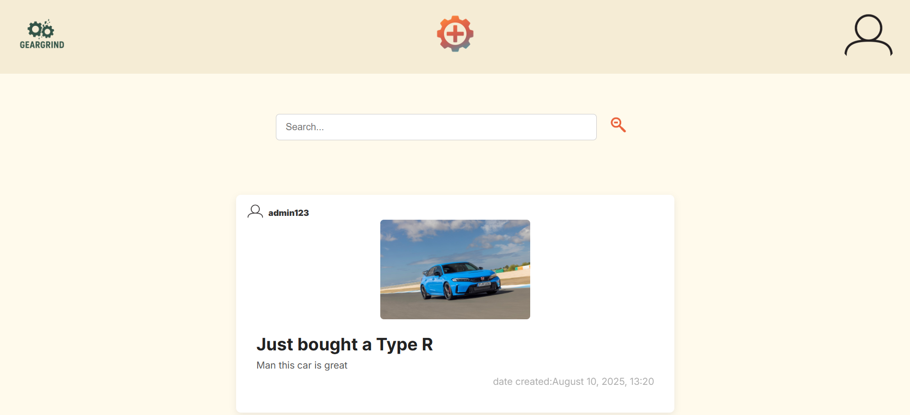
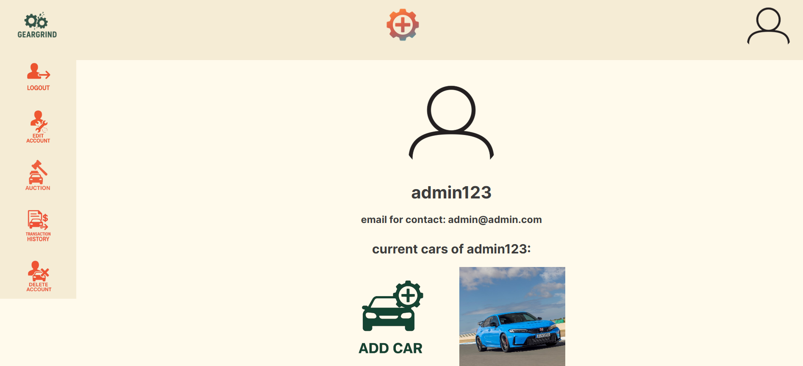
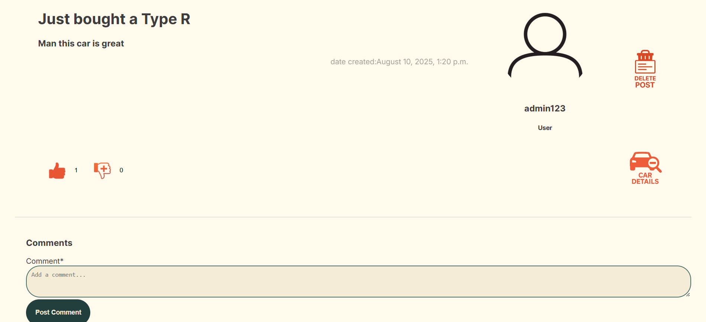
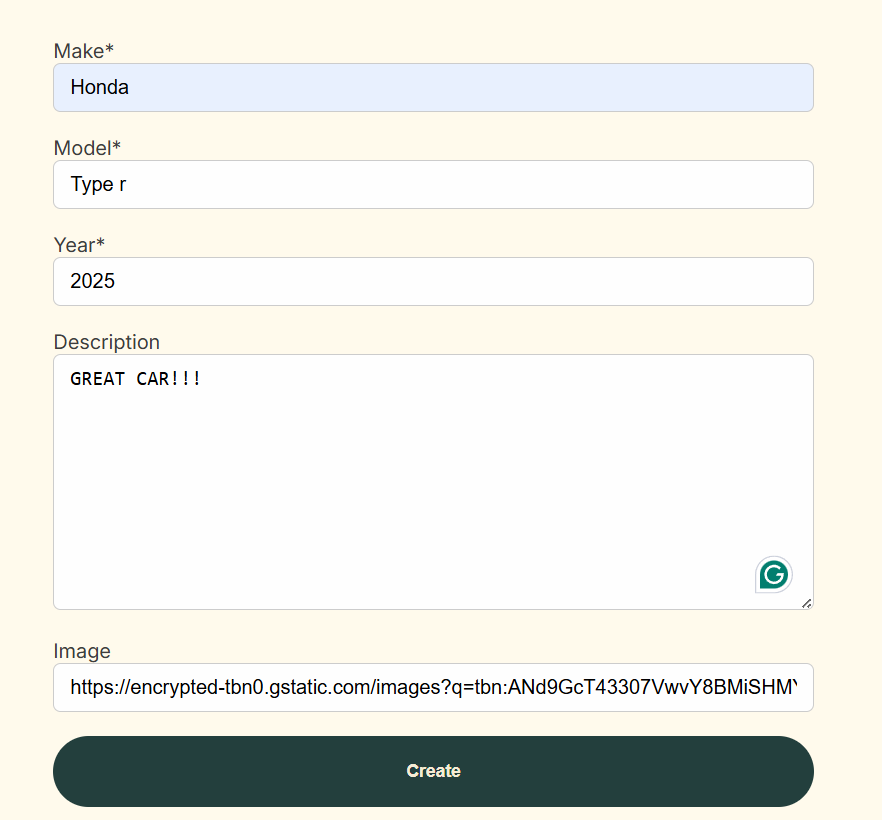
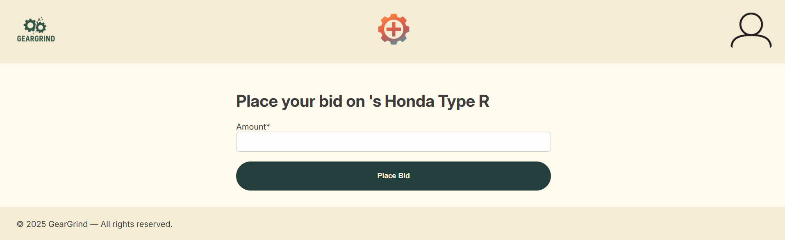
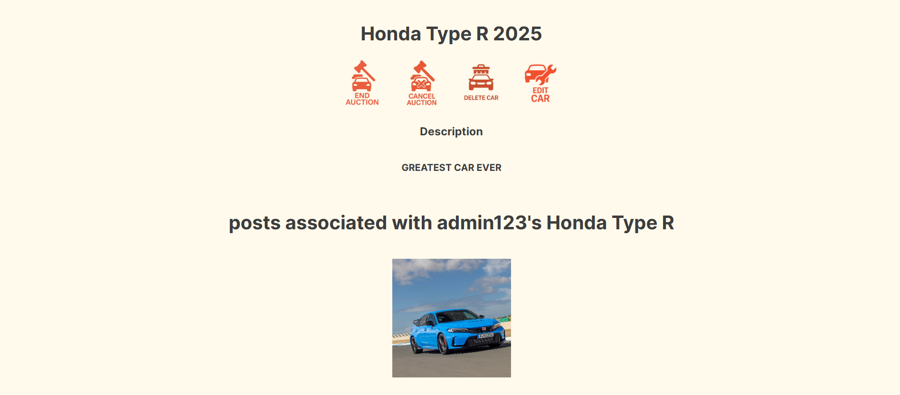
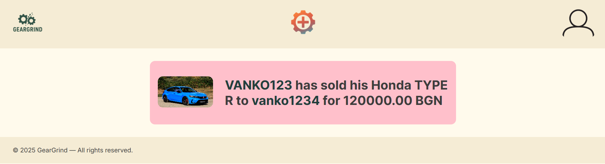
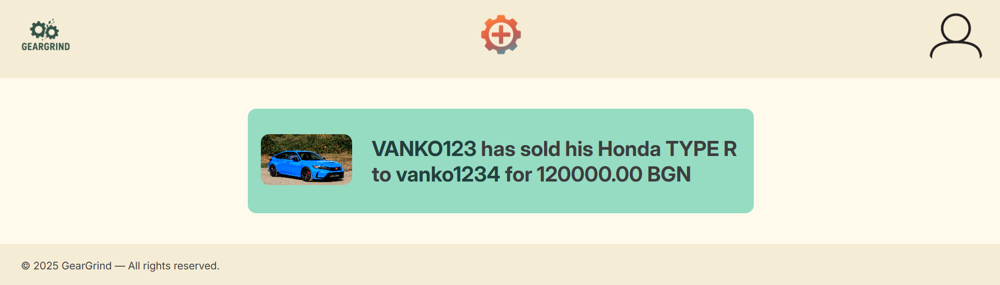

<p align="center">
  
</p>

# 🚗 GearGrind

> **A Social Media Platform for Car Enthusiasts**  
> Share your passion, showcase your rides, and connect with fellow gearheads.

---

## 📌 About GearGrind
**GearGrind** is a social media platform built for car lovers.  
It allows users to share posts, showcase their cars, and even sell them via an auction system.  
Whether you want to post about your latest car mod, browse other enthusiasts’ rides, or place a bid on your dream car — GearGrind has you covered.

---

## ✨ Features
- 📝 **Share Posts** — Post updates, modifications, and stories about your cars.
- 🚘 **Car Profiles** — Add your cars to your personal profile.
- 📷 **Car Posts** — Create posts specific to each of your vehicles.
- 💰 **Car Auctions** — Put your car up for sale via the built-in auction system.
- 🛒 **Buy & Bid** — Participate in auctions and purchase cars from other users.

---

## 🖼 Screenshots
*(Coming Soon — Add screenshots of the app here)*

---

## 🔗 Live Demo
**[View GearGrind Live](https://geargrind-brgde5hgaqf6dugy.italynorth-01.azurewebsites.net/)**

---

## 🛠 Tech Stack
- **Backend:** Django
- **Database:** PostgreSQL
- **Frontend:** HTML, CSS, JavaScript
- **Deployment:** Azure Web Apps

---

## ⚙ Installation & Local Setup

Clone the repository:
```bash
git clone https://github.com/Ta7off/GearGrind.git
cd GearGrind
```

Create and activate a virtual environment:
```bash
python -m venv venv
source venv/bin/activate  # On Linux/Mac
venv\Scripts\activate     # On Windows
```

Install dependencies:
```bash
pip install -r requirements.txt
```

Apply database migrations:

```bash
python manage.py migrate
```
Run the development server:

```bash
python manage.py runserver
```

## ⚙ Environment Configuration
Create a .env file in the root directory with the following content:

```env
SECRET_KEY=your-django-secret-key
DEBUG=False
ALLOWED_HOSTS=geargrind-brgde5hgaqf6dugy.italynorth-01.azurewebsites.net,localhost,127.0.0.1
DB_NAME=your-db-name
DB_USER=your-db-user
DB_PASSWORD=your-db-password
DB_HOST=your-db-host
DB_PORT=your-db-port
```
Make sure your PostgreSQL server is running and the database is created before launching the app.

## 📷 Screenshots

### Homepage


### Account Details


### Post Details


### Add Car Form


### Bidding Page


### Car Details


## Transactions

